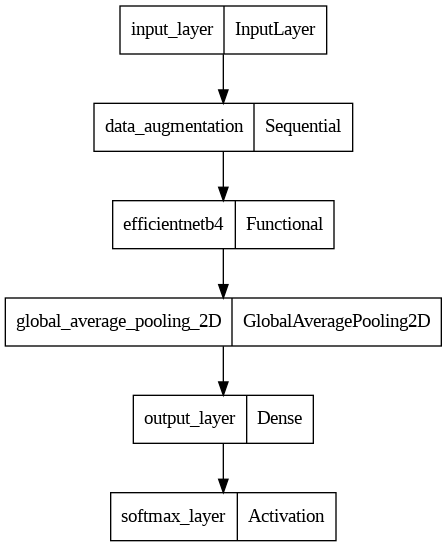

# Food Vision

In this project, I have tested EfficientNetB0 and EfficientNetB4 models in order to classify food images in Food-101 dataset from Kaggle. I have used different deep learning and transfer learning models like EfficientNetB0 on this dataset along with data augmentation to compare different models and achieve the best results possible. Finally the model has been evaluated and the top 100 most wrong predictions have been observed. The models have been fine tuned to beat the [DeepFood](https://arxiv.org/abs/1606.05675) paper.

## Data

This projects is an image multi-classification task done on Food-101 dataset from tensorflow datasets. This dataset consists of 101 categories of food organized in different folders. Here you can see an example of such data:


I have used out of the box data to test the model as well. This data will be automatically downloaded while the notebook is running.

## Features

- Image multi-class classification
- Fine tuning pretrained EfficientNet models: You can see the EfficientNetB4 model summary in the picture below:



## Installation

You can install the required libraries by the command below:

```bash
pip install -r requirements.txt
```

## Run

You can run the notebook on Colab, Kaggle or jupyter notebook.

Clone the project

```bash
  git clone https://github.com/MrAliAmani/FoodVision
```

## Results

The classification performance (f1-score) on different classes has been measured.


The model has reached 0.7166 performance with regards to accuracy score. You can some model predictions below:


Furthermore, the confusion matrix has been plotted to complete evaluation.


 
The training loss and accuracy curves are plotted to visualize the feature extraction and fine tuning step.


Finally, the model's 100 top wrong predictions have been observed.


## Lessons Learned

Fine tuning pretrained models like EfficientNet has shown high performance on custom and out of the box image data.

## Papers

**[DeepFood: Deep Learning-Based Food Image Recognition for Computer-Aided Dietary Assessment](https://arxiv.org/abs/1606.05675)** paper from Chang Liu et al.

## License

This project is under MIT license:

[](https://choosealicense.com/licenses/mit/)

## Feedback

If you have any feedback, please reach out to me at *<aliamani019@gmail.com>*.

## Authors

[@AliAmani](https://github.com/MrAliAmani)
